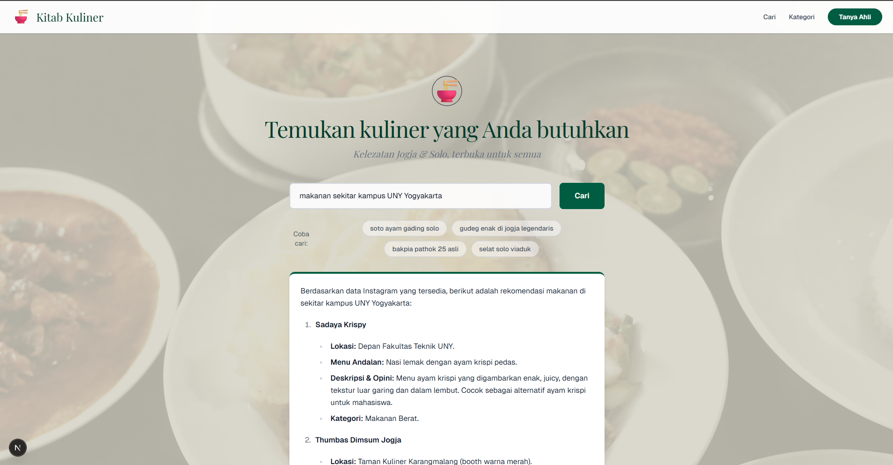

# 🍜 Kitab Kuliner — Culinary RAG Chatbot

<p align="center">
  
</p>

<p align="center">
  
  
  
  
  
</p>

## 📖 Overview

**Kitab Kuliner** adalah aplikasi chatbot berbasis **Retrieval-Augmented Generation (RAG)** yang memberikan rekomendasi kuliner di wilayah **Surakarta (Solo)** dan **Yogyakarta**. Proyek ini merupakan hasil kegiatan magang di **DataIns** sebagai Data Scientist.

Data dikumpulkan dari Instagram melalui scraping, lalu diproses menjadi knowledge base yang digunakan untuk menjawab pertanyaan seputar kuliner secara akurat dan kontekstual.

---

## ✨ Features

- 🗺️ **Multi-region support** — Mencakup wilayah Surakarta dan Yogyakarta
- 🤖 **RAG Pipeline** — Retrieval berbasis vektor semantik + generasi jawaban dengan LLM
- 💾 **Embedding & Vector Store lokal** — Tidak bergantung pada API eksternal untuk pencarian
- 🔍 **Semantic Search** — Menggunakan model `jina-embeddings-v3` untuk pemahaman bahasa Indonesia
- 🌐 **Web Interface** — Frontend Next.js dengan tampilan modern

---

## 🗂️ Data Pipeline

Data diproses melalui beberapa tahap:

```
01_raw              → Data mentah hasil scraping Instagram
02_intermediate     → Ekstraksi informasi awal (nama tempat, menu, lokasi, dll.)
03_advance          → Ekstraksi lanjutan & cleaning
04_knowledge_base   → Knowledge base final untuk RAG
```

Sumber data berasal dari akun Instagram kuliner populer di Solo dan Yogyakarta (mis. `@solodelicious`, `@jogjabikinlaper`, `@kulinerjogya`, dll.).

> **Catatan:** Dataset belum dipublikasikan secara terbuka. Hubungi penulis untuk akses.

---

## 🛠️ Tech Stack

| Komponen | Teknologi |
|---|---|
| **LLM** | DeepSeek API (`deepseek-chat`) |
| **Embedding** | `multilingual-e5-small` (lokal) |
| **Vector DB** | ChromaDB (lokal) |
| **RAG Framework** | LangChain |
| **Frontend** | Next.js + Tailwind CSS |
| **Backend API** | FastAPI |
| **Data Processing** | Pandas, Jupyter Notebook |

---

## 🚀 Getting Started

### Prerequisites

- Python 3.9+
- Node.js 18+ (untuk frontend)
- DeepSeek API Key

### Installation

1. **Clone repository**
   ```bash
   git clone <repo-url>
   cd CulinaryRAG
   ```

2. **Install dependencies Python**
   ```bash
   pip install -r requirements.txt
   ```

3. **Setup environment variable**
   ```bash
   # Buat file .env di root project
   DEEPSEEK_API_KEY=your_api_key_here
   ```

4. **Download embedding model**
   ```bash
   python models/download_model.py
   ```

5. **Jalankan aplikasi (CLI)**
   ```bash
   python -m src.main
   ```

6. **Jalankan frontend**
   ```bash
   cd frontend
   npm install
   npm run dev
   ```

---

## 📁 Project Structure

```
CulinaryRAG/
├── src/                    # Core RAG pipeline
│   ├── main.py             # Entry point (CLI)
│   ├── search.py           # Semantic search
│   ├── vector_store.py     # ChromaDB interface
│   ├── build_documents.py  # Document builder
│   └── utils.py            # Helper functions
├── frontend/               # Next.js web interface
├── backend/                # FastAPI backend
├── data/                   # Data pipeline stages
├── models/                 # Embedding & LLM models (lokal)
├── vector_db/              # ChromaDB persistent storage
├── notebooks/              # Eksplorasi & preprocessing
├── instagram_scapping/     # Scraping scripts
└── config/                 # Konfigurasi path & model
```

---

## 🔮 Future Work

- [ ] Deployment publik (cloud hosting)
- [ ] Penambahan data untuk region lain di Indonesia
- [ ] Filter pencarian berdasarkan kategori, harga, dan lokasi
- [ ] Integrasi Google Maps untuk info lokasi lengkap
- [ ] Mobile-friendly UI

---

## � Credits

- **UI Design Inspiration** — Tampilan frontend terinspirasi dari [pasal.id](https://pasal.id) oleh [@ilhamfputra](https://github.com/ilhamfputra)

---

## �📬 Contact

Dataset atau knowledge base belum dipublikasikan. Jika Anda membutuhkan akses atau ingin berkolaborasi, silakan hubungi penulis.